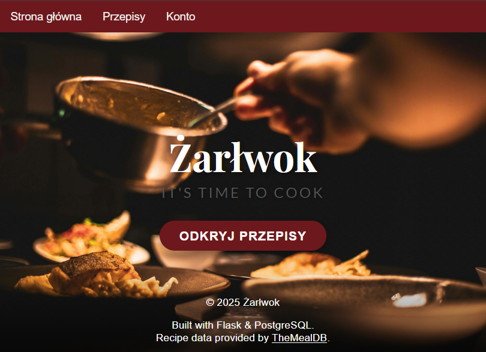

# Aplikacja webowa flask

## System webowy umożliwiający prowadzenie bloga z przepisami oraz udostępniający możliwość interkacji użytkowników z danymi przepisami (oceny, komentarze)

## Stack technologiczny
W skład aplikacji na chwilę obecną wchodzi:
- **Backend:** Python, Flask, Flask-Login, Flask-SQLAlchemy - hostowany na Render  
- **Frontend:** HTML, CSS, JavaScript, szablony Jinja2  
- **Baza danych:** PostgreSQL - hostowana na Render, oraz zdjęcia przepisów na Cloudinary
- **DevOps:** Docker, Docker Compose, CI Workflow do automatycznej weryfikacji buildów 

## Kluczowe funkcjonalności
Aplikacja na chwilę obecną umożliwia:
- dodawanie przepisów
- administracje zawartością strony poprzez panel administratora
- logowanie i uwierzytelnianie z użyciem **Flask-Login**

## Źródło danych
Przepisy, instrukcje i zdjęcia pochodzą z API **[TheMealDB](https://www.themealdb.com)**.

Na potrzeby projektu dane zmodyfikowano - przepisy przetłumaczono na język polski, metadane przepisu takie jak czas przygotowania, liczba porcji i trudność zostałą dodana arbitralnie.

## GUI
Warstwa graficzna systemu opiera się na prostych stylach CSS. Zaimplementowano responsywność.  Na ten moment strona nie jest dokończa.

